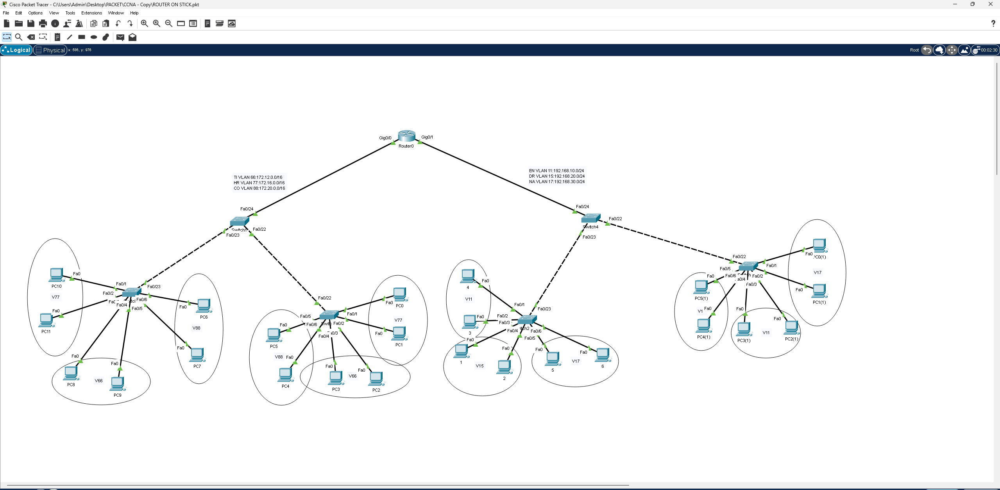

# Router on a Stick – التوجيه بين VLANs عبر رابط واحد

## 📖 الوصف
مشروع يطبق تقنية **Router-on-a-Stick**، حيث يتم التوجيه بين عدة شبكات VLAN باستخدام رابط فيزيائي واحد (Trunk) بين الراوتر والسويتش، عبر تقسيم الواجهة إلى واجهات فرعية (Sub-interfaces).

## 🗺️ التصميم (Topology)

- راوتر مركزي (**Router0**) متصل بمنفذين Gigabit (Gig0/0, Gig0/1) بسويتشين رئيسيين (Distribution Switches)
- كل سويتش رئيسي متصل بعدة سويتشات وصول (Access Switches) تخدم مجموعات VLAN مختلفة

### شبكات VLAN المستخدمة
| VLAN | الاسم | الشبكة |
|------|-------|--------|
| 11 | EN | `192.168.10.0/24` |
| 15 | DR | `192.168.20.0/24` |
| 17 | NA | `192.168.30.0/24` |
| 66 | TI | `172.12.0.0/16` |
| 77 | HR | `172.16.0.0/16` |
| 88 | CO | `172.20.0.0/16` |

## ⚙️ المفاهيم المطبقة
- تقسيم الشبكة إلى VLANs متعددة لعزل الأقسام (مثل HR, IT, CO, EN)
- إعداد **Trunk Ports** بين السويتشات والراوتر
- إنشاء **Sub-interfaces** على الراوتر (مثال: `Gig0/0.11`, `Gig0/0.15`) لكل VLAN مع تفعيل `encapsulation dot1Q`
- توجيه حركة المرور بين VLANs المختلفة عبر رابط فيزيائي واحد فقط

## 🎯 الهدف من المشروع
فهم كيفية تمكين الاتصال بين شبكات VLAN معزولة منطقيًا باستخدام راوتر واحد فقط عبر تقنية Router-on-a-Stick، بدلاً من استخدام منفذ فيزيائي منفصل لكل VLAN.

## 📂 الملف
- [`Router-on-a-Stick.pkt`](./Router-on-a-Stick.pkt) — ملف Packet Tracer الكامل
